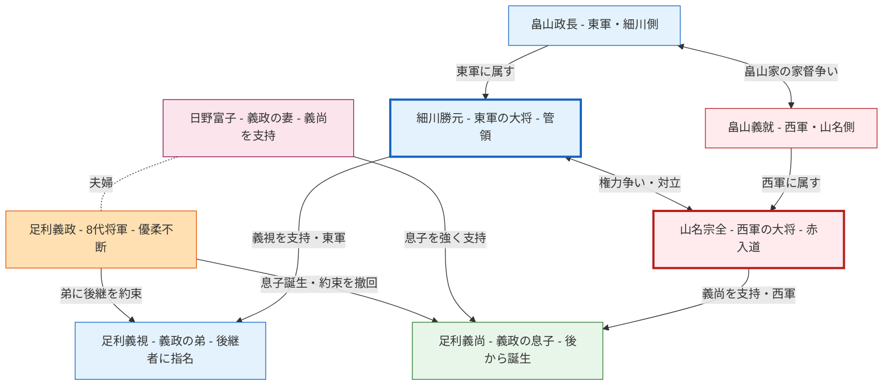

# ⚔️ 応仁の乱① 名分なき戦いの幕開け

## <ruby>名分<rt>めいぶん</rt></ruby>なき<ruby>戦<rt>たたかい</rt></ruby>いの<ruby>幕開<rt>まくあ</rt></ruby>け

> **レベル：N2〜N3** ｜ テーマ：<ruby>日本<rt>にほん</rt></ruby>の<ruby>歴史<rt>れきし</rt></ruby>・<ruby>応仁<rt>おうにん</rt></ruby>の<ruby>乱<rt>らん</rt></ruby>（<ruby>全<rt>ぜん</rt></ruby>２<ruby>回<rt>かい</rt></ruby>）

---

## 📖 Part 1 ― <ruby>単語<rt>たんご</rt></ruby>リスト

| # | <ruby>単語<rt>たんご</rt></ruby> | <ruby>読<rt>よ</rt></ruby>み | <ruby>意味<rt>いみ</rt></ruby>（<ruby>韓国語<rt>かんこくご</rt></ruby>） | <ruby>意味<rt>いみ</rt></ruby>（<ruby>英語<rt>えいご</rt></ruby>） |
|---|------|------|----------------|-------------|
| 1 | <ruby>後継者<rt>こうけいしゃ</rt></ruby> | こうけいしゃ | 후계자 | successor |
| 2 | <ruby>優柔不断<rt>ゆうじゅうふだん</rt></ruby> | ゆうじゅうふだん | 우유부단 | indecisiveness |
| 3 | <ruby>内乱<rt>ないらん</rt></ruby> | ないらん | 내란 | civil war |
| 4 | <ruby>実力者<rt>じつりょくしゃ</rt></ruby> | じつりょくしゃ | 실력자 | powerful figure |
| 5 | <ruby>派閥<rt>はばつ</rt></ruby> | はばつ | 파벌 | faction |
| 6 | <ruby>対立<rt>たいりつ</rt></ruby> | たいりつ | 대립 | confrontation |

### <ruby>例文<rt>れいぶん</rt></ruby>

**1. <ruby>後継者<rt>こうけいしゃ</rt></ruby>**

> <ruby>将軍<rt>しょうぐん</rt></ruby>が<ruby>後継者<rt>こうけいしゃ</rt></ruby>を<ruby>決<rt>き</rt></ruby>めなかったことが、<ruby>大<rt>おお</rt></ruby>きな<ruby>混乱<rt>こんらん</rt></ruby>を<ruby>招<rt>まね</rt></ruby>いた。

**2. <ruby>優柔不断<rt>ゆうじゅうふだん</rt></ruby>**

> <ruby>優柔不断<rt>ゆうじゅうふだん</rt></ruby>なリーダーは、<ruby>組織<rt>そしき</rt></ruby>全体を<ruby>危機<rt>きき</rt></ruby>に<ruby>陥<rt>おとしい</rt></ruby>れることがある。

**3. <ruby>内乱<rt>ないらん</rt></ruby>**

> <ruby>応仁<rt>おうにん</rt></ruby>の<ruby>乱<rt>らん</rt></ruby>は、11<ruby>年<rt>ねん</rt></ruby>も<ruby>続<rt>つづ</rt></ruby>いた<ruby>大規模<rt>だいきぼ</rt></ruby>な<ruby>内乱<rt>ないらん</rt></ruby>だった。

**4. <ruby>実力者<rt>じつりょくしゃ</rt></ruby>**

> <ruby>細川勝元<rt>ほそかわかつもと</rt></ruby>と<ruby>山名宗全<rt>やまなそうぜん</rt></ruby>は、<ruby>当時<rt>とうじ</rt></ruby>の<ruby>二大<rt>にだい</rt></ruby><ruby>実力者<rt>じつりょくしゃ</rt></ruby>だった。

**5. <ruby>派閥<rt>はばつ</rt></ruby>**

> <ruby>全国<rt>ぜんこく</rt></ruby>の<ruby>大名<rt>だいみょう</rt></ruby>が<ruby>東軍<rt>とうぐん</rt></ruby>と<ruby>西軍<rt>せいぐん</rt></ruby>の<ruby>二<rt>ふた</rt></ruby>つの<ruby>派閥<rt>はばつ</rt></ruby>に<ruby>分<rt>わ</rt></ruby>かれた。

**6. <ruby>対立<rt>たいりつ</rt></ruby>**

> <ruby>二人<rt>ふたり</rt></ruby>の<ruby>実力者<rt>じつりょくしゃ</rt></ruby>の<ruby>対立<rt>たいりつ</rt></ruby>が、やがて<ruby>全国<rt>ぜんこく</rt></ruby>を<ruby>巻<rt>ま</rt></ruby>き<ruby>込<rt>こ</rt></ruby>む<ruby>戦争<rt>せんそう</rt></ruby>へと<ruby>発展<rt>はってん</rt></ruby>した。

---

## 👥 <ruby>登場人物<rt>とうじょうじんぶつ</rt></ruby>・<ruby>関係図<rt>かんけいず</rt></ruby>

:::info
以下の関係図で、主な登場人物とその関係を確認しましょう。
:::

**🔑 ポイント**

| <ruby>人物<rt>じんぶつ</rt></ruby> | <ruby>立場<rt>たちば</rt></ruby> | <ruby>支持<rt>しじ</rt></ruby> |
|------|------|------|
| <ruby>細川勝元<rt>ほそかわかつもと</rt></ruby> | <ruby>東軍<rt>とうぐん</rt></ruby> | <ruby>足利義視<rt>あしかがよしみ</rt></ruby>（<ruby>弟<rt>おとうと</rt></ruby>） |
| <ruby>山名宗全<rt>やまなそうぜん</rt></ruby> | <ruby>西軍<rt>せいぐん</rt></ruby> | <ruby>足利義尚<rt>あしかがよしひさ</rt></ruby>（<ruby>息子<rt>むすこ</rt></ruby>） |

---

## 📝 Part 2 ― <ruby>本文<rt>ほんぶん</rt></ruby>

### <ruby>将軍<rt>しょうぐん</rt></ruby>の<ruby>迷<rt>まよ</rt></ruby>いが<ruby>火<rt>ひ</rt></ruby>をつけた

#### <ruby>一<rt>いち</rt></ruby>、<ruby>約束<rt>やくそく</rt></ruby>を<ruby>破<rt>やぶ</rt></ruby>った<ruby>将軍<rt>しょうぐん</rt></ruby>

　<ruby>室町幕府<rt>むろまちばくふ</rt></ruby>の８<ruby>代<rt>だい</rt></ruby><ruby>将軍<rt>しょうぐん</rt></ruby>・<ruby>足利義政<rt>あしかがよしまさ</rt></ruby>は、<ruby>政治<rt>せいじ</rt></ruby>にあまり<ruby>関心<rt>かんしん</rt></ruby>がなく、<ruby>茶<rt>ちゃ</rt></ruby>の<ruby>湯<rt>ゆ</rt></ruby>や<ruby>庭園造<rt>ていえんづく</rt></ruby>りなど<ruby>文化<rt>ぶんか</rt></ruby>・<ruby>芸術<rt>げいじゅつ</rt></ruby>に<ruby>熱中<rt>ねっちゅう</rt></ruby>していた<ruby>人物<rt>じんぶつ</rt></ruby>でした。<ruby>子<rt>こ</rt></ruby>どもがいなかった<ruby>義政<rt>よしまさ</rt></ruby>は、1464<ruby>年<rt>ねん</rt></ruby>に<ruby>弟<rt>おとうと</rt></ruby>の<ruby>義視<rt>よしみ</rt></ruby>を<ruby>後継者<rt>こうけいしゃ</rt></ruby>に<ruby>指名<rt>しめい</rt></ruby>し、「<ruby>将軍職<rt>しょうぐんしょく</rt></ruby>を<ruby>譲<rt>ゆず</rt></ruby>る」と<ruby>約束<rt>やくそく</rt></ruby>しました。

　ところが<ruby>翌年<rt>よくとし</rt></ruby>、<ruby>義政<rt>よしまさ</rt></ruby>の<ruby>妻<rt>つま</rt></ruby>・<ruby>日野富子<rt>ひのとみこ</rt></ruby>が<ruby>男児<rt>だんじ</rt></ruby>（<ruby>義尚<rt>よしひさ</rt></ruby>）を<ruby>出産<rt>しゅっさん</rt></ruby>しました。<ruby>富子<rt>とみこ</rt></ruby>は<ruby>強<rt>つよ</rt></ruby>く<ruby>息子<rt>むすこ</rt></ruby>を<ruby>将軍<rt>しょうぐん</rt></ruby>にしたいと<ruby>望<rt>のぞ</rt></ruby>み、<ruby>義政<rt>よしまさ</rt></ruby>は<ruby>弟<rt>おとうと</rt></ruby>への<ruby>約束<rt>やくそく</rt></ruby>をあっさりと<ruby>翻<rt>ひるがえ</rt></ruby>しました。こうして<ruby>後継者<rt>こうけいしゃ</rt></ruby>が<ruby>二人<rt>ふたり</rt></ruby>いるという、きわめて<ruby>不安定<rt>ふあんてい</rt></ruby>な<ruby>状況<rt>じょうきょう</rt></ruby>が<ruby>生<rt>う</rt></ruby>まれたのです。

#### <ruby>二<rt>に</rt></ruby>、<ruby>実力者<rt>じつりょくしゃ</rt></ruby>たちの<ruby>思惑<rt>おもわく</rt></ruby>

　この<ruby>後継者問題<rt>こうけいしゃもんだい</rt></ruby>に<ruby>目<rt>め</rt></ruby>をつけたのが、<ruby>幕府<rt>ばくふ</rt></ruby>を<ruby>実質的<rt>じっしつてき</rt></ruby>に<ruby>支<rt>ささ</rt></ruby>えていた<ruby>二<rt>ふた</rt></ruby>つの<ruby>勢力<rt>せいりょく</rt></ruby>でした。<ruby>管領<rt>かんれい</rt></ruby>（<ruby>将軍<rt>しょうぐん</rt></ruby>の<ruby>補佐役<rt>ほさやく</rt></ruby>）を<ruby>務<rt>つと</rt></ruby>める<ruby>細川勝元<rt>ほそかわかつもと</rt></ruby>は、<ruby>義視<rt>よしみ</rt></ruby>を<ruby>支持<rt>しじ</rt></ruby>して「<ruby>東軍<rt>とうぐん</rt></ruby>」を<ruby>形成<rt>けいせい</rt></ruby>しました。<ruby>一方<rt>いっぽう</rt></ruby>、<ruby>西国<rt>さいごく</rt></ruby>の<ruby>大名<rt>だいみょう</rt></ruby>を<ruby>多<rt>おお</rt></ruby>く<ruby>束<rt>たば</rt></ruby>ねる<ruby>山名宗全<rt>やまなそうぜん</rt></ruby>は「<ruby>赤入道<rt>あかにゅうどう</rt></ruby>」の<ruby>異名<rt>いみょう</rt></ruby>をもつ<ruby>猛将<rt>もうしょう</rt></ruby>で、<ruby>義尚<rt>よしひさ</rt></ruby>を<ruby>支持<rt>しじ</rt></ruby>して「<ruby>西軍<rt>せいぐん</rt></ruby>」を<ruby>率<rt>ひき</rt></ruby>いました。

　さらに、<ruby>大名家<rt>だいみょうけ</rt></ruby>の<ruby>畠山<rt>はたけやま</rt></ruby>でも<ruby>家督争<rt>かとくあらそ</rt></ruby>いが<ruby>起<rt>お</rt></ruby>きており、これも<ruby>東西<rt>とうざい</rt></ruby>の<ruby>対立<rt>たいりつ</rt></ruby>に<ruby>火<rt>ひ</rt></ruby>を<ruby>注<rt>そそ</rt></ruby>ぎました。<ruby>全国<rt>ぜんこく</rt></ruby>の<ruby>大名<rt>だいみょう</rt></ruby>たちは<ruby>自<rt>じ</rt></ruby>らの<ruby>利益<rt>りえき</rt></ruby>のために<ruby>東軍<rt>とうぐん</rt></ruby>か<ruby>西軍<rt>せいぐん</rt></ruby>かを<ruby>選<rt>えら</rt></ruby>び、<ruby>続々<rt>ぞくぞく</rt></ruby>と<ruby>京都<rt>きょうと</rt></ruby>に<ruby>集結<rt>しゅうけつ</rt></ruby>していきました。

#### <ruby>三<rt>さん</rt></ruby>、<ruby>応仁<rt>おうにん</rt></ruby>元年、<ruby>戦火<rt>せんか</rt></ruby>の<ruby>始<rt>はじ</rt></ruby>まり

　1467<ruby>年<rt>ねん</rt></ruby>（<ruby>応仁<rt>おうにん</rt></ruby>元年）、ついに<ruby>東軍<rt>とうぐん</rt></ruby>と<ruby>西軍<rt>せいぐん</rt></ruby>は<ruby>京都<rt>きょうと</rt></ruby>の<ruby>街<rt>まち</rt></ruby>で<ruby>激突<rt>げきとつ</rt></ruby>しました。<ruby>東軍<rt>とうぐん</rt></ruby>の<ruby>兵力<rt>へいりょく</rt></ruby>は<ruby>約<rt>やく</rt></ruby>16<ruby>万<rt>まん</rt></ruby>、<ruby>西軍<rt>せいぐん</rt></ruby>は<ruby>約<rt>やく</rt></ruby>11<ruby>万<rt>まん</rt></ruby>とも<ruby>言<rt>い</rt></ruby>われています。かつて<ruby>貴族文化<rt>きぞくぶんか</rt></ruby>が<ruby>花開<rt>はなひら</rt></ruby>いた<ruby>美<rt>うつく</rt></ruby>しい<ruby>京都<rt>きょうと</rt></ruby>が、<ruby>戦場<rt>せんじょう</rt></ruby>へと<ruby>変<rt>か</rt></ruby>わってしまったのです。

　<ruby>皮肉<rt>ひにく</rt></ruby>なことに、<ruby>当<rt>とう</rt></ruby>の<ruby>将軍<rt>しょうぐん</rt></ruby>・<ruby>義政<rt>よしまさ</rt></ruby>は<ruby>戦<rt>たたかい</rt></ruby>いが<ruby>始<rt>はじ</rt></ruby>まった<ruby>後<rt>あと</rt></ruby>も<ruby>茶<rt>ちゃ</rt></ruby>の<ruby>湯<rt>ゆ</rt></ruby>を<ruby>楽<rt>たの</rt></ruby>しんでいたと<ruby>言<rt>い</rt></ruby>われています。<ruby>名分<rt>めいぶん</rt></ruby>なき<ruby>内乱<rt>ないらん</rt></ruby>の<ruby>幕<rt>まく</rt></ruby>は、こうして<ruby>上<rt>あ</rt></ruby>がったのです。

---

## ❓ Part 3 ― <ruby>内容確認<rt>ないようかくにん</rt></ruby>

**Q1.** <ruby>足利義政<rt>あしかがよしまさ</rt></ruby>はなぜ<ruby>弟<rt>おとうと</rt></ruby>に<ruby>将軍職<rt>しょうぐんしょく</rt></ruby>を<ruby>譲<rt>ゆず</rt></ruby>ると<ruby>約束<rt>やくそく</rt></ruby>しましたか。

**Q2.** <ruby>義政<rt>よしまさ</rt></ruby>が<ruby>約束<rt>やくそく</rt></ruby>を<ruby>翻<rt>ひるがえ</rt></ruby>した<ruby>理由<rt>りゆう</rt></ruby>は<ruby>何<rt>なん</rt></ruby>ですか。

**Q3.** <ruby>細川勝元<rt>ほそかわかつもと</rt></ruby>は<ruby>誰<rt>だれ</rt></ruby>を<ruby>支持<rt>しじ</rt></ruby>しましたか。<ruby>山名宗全<rt>やまなそうぜん</rt></ruby>は<ruby>誰<rt>だれ</rt></ruby>を<ruby>支持<rt>しじ</rt></ruby>しましたか。

**Q4.** <ruby>全国<rt>ぜんこく</rt></ruby>の<ruby>大名<rt>だいみょう</rt></ruby>はなぜ<ruby>京都<rt>きょうと</rt></ruby>に<ruby>集<rt>あつ</rt></ruby>まってきましたか。

**Q5.** <ruby>応仁<rt>おうにん</rt></ruby>の<ruby>乱<rt>らん</rt></ruby>が<ruby>始<rt>はじ</rt></ruby>まった<ruby>年<rt>ねん</rt></ruby>と、<ruby>東西<rt>とうざい</rt></ruby>それぞれの<ruby>兵力<rt>へいりょく</rt></ruby>を<ruby>答<rt>こた</rt></ruby>えてください。

**Q6.** <ruby>戦<rt>たたかい</rt></ruby>いが<ruby>始<rt>はじ</rt></ruby>まった<ruby>後<rt>あと</rt></ruby>、<ruby>義政<rt>よしまさ</rt></ruby>はどうしていましたか。

---

## ✏️ Part 4 ― <ruby>単語<rt>たんご</rt></ruby>を<ruby>使<rt>つか</rt></ruby>って<ruby>文<rt>ぶん</rt></ruby>を<ruby>作<rt>つく</rt></ruby>ろう

**1.** 「<ruby>後継者<rt>こうけいしゃ</rt></ruby>」を<ruby>使<rt>つか</rt></ruby>って<ruby>文<rt>ぶん</rt></ruby>を<ruby>作<rt>つく</rt></ruby>ってください。

**2.** 「<ruby>優柔不断<rt>ゆうじゅうふだん</rt></ruby>」を<ruby>使<rt>つか</rt></ruby>って、あなたの<ruby>経験<rt>けいけん</rt></ruby>や<ruby>身近<rt>みぢか</rt></ruby>な<ruby>例<rt>れい</rt></ruby>について<ruby>話<rt>はな</rt></ruby>してください。

**3.** 「<ruby>内乱<rt>ないらん</rt></ruby>」を<ruby>使<rt>つか</rt></ruby>って<ruby>文<rt>ぶん</rt></ruby>を<ruby>作<rt>つく</rt></ruby>ってください。

**4.** 「<ruby>実力者<rt>じつりょくしゃ</rt></ruby>」を<ruby>使<rt>つか</rt></ruby>って、<ruby>現代<rt>げんだい</rt></ruby>の<ruby>政治<rt>せいじ</rt></ruby>や<ruby>会社<rt>かいしゃ</rt></ruby>について<ruby>話<rt>はな</rt></ruby>してください。

**5.** 「<ruby>派閥<rt>はばつ</rt></ruby>」を<ruby>使<rt>つか</rt></ruby>って<ruby>文<rt>ぶん</rt></ruby>を<ruby>作<rt>つく</rt></ruby>ってください。

**6.** 「<ruby>対立<rt>たいりつ</rt></ruby>」を<ruby>使<rt>つか</rt></ruby>って<ruby>文<rt>ぶん</rt></ruby>を<ruby>作<rt>つく</rt></ruby>ってください。

---

## 💬 Part 5 ― ディスカッション（<ruby>本文<rt>ほんぶん</rt></ruby><ruby>関連<rt>かんれん</rt></ruby>）

**1.** <ruby>義政<rt>よしまさ</rt></ruby>が<ruby>弟<rt>おとうと</rt></ruby>への<ruby>約束<rt>やくそく</rt></ruby>を<ruby>守<rt>まも</rt></ruby>っていたら、<ruby>応仁<rt>おうにん</rt></ruby>の<ruby>乱<rt>らん</rt></ruby>は<ruby>起<rt>お</rt></ruby>きなかったと<ruby>思<rt>おも</rt></ruby>いますか。

**2.** <ruby>細川<rt>ほそかわ</rt></ruby>と<ruby>山名<rt>やまな</rt></ruby>が<ruby>将軍後継者問題<rt>しょうぐんこうけいしゃもんだい</rt></ruby>を<ruby>利用<rt>りよう</rt></ruby>した<ruby>本当<rt>ほんとう</rt></ruby>の<ruby>目的<rt>もくてき</rt></ruby>は<ruby>何<rt>なん</rt></ruby>だったと<ruby>思<rt>おも</rt></ruby>いますか。

**3.** もしあなたが<ruby>弟<rt>おとうと</rt></ruby>の<ruby>義視<rt>よしみ</rt></ruby>だったら、<ruby>約束<rt>やくそく</rt></ruby>を<ruby>破<rt>やぶ</rt></ruby>られたときどうしましたか。

**4.** もしあなたが<ruby>息子<rt>むすこ</rt></ruby>・<ruby>義尚<rt>よしひさ</rt></ruby>の<ruby>母親<rt>ははおや</rt></ruby>・<ruby>日野富子<rt>ひのとみこ</rt></ruby>だったら、この<ruby>状況<rt>じょうきょう</rt></ruby>でどう<ruby>行動<rt>こうどう</rt></ruby>しましたか。

**5.** リーダーの<ruby>優柔不断<rt>ゆうじゅうふだん</rt></ruby>が<ruby>組織<rt>そしき</rt></ruby>に<ruby>与<rt>あた</rt></ruby>える<ruby>影響<rt>えいきょう</rt></ruby>について、どう<ruby>思<rt>おも</rt></ruby>いますか。

---

## 🗣️ Part 6 ― フリーディスカッション

**1.** あなたの<ruby>国<rt>くに</rt></ruby>の<ruby>歴史<rt>れきし</rt></ruby>で、<ruby>権力者<rt>けんりょくしゃ</rt></ruby>の<ruby>個人的<rt>こじんてき</rt></ruby>な<ruby>問題<rt>もんだい</rt></ruby>が<ruby>大<rt>おお</rt></ruby>きな<ruby>争<rt>あらそ</rt></ruby>いに<ruby>発展<rt>はってん</rt></ruby>した<ruby>例<rt>れい</rt></ruby>はありますか。

**2.** 「<ruby>約束<rt>やくそく</rt></ruby>を<ruby>守<rt>まも</rt></ruby>ること」と「<ruby>家族<rt>かぞく</rt></ruby>を<ruby>守<rt>まも</rt></ruby>ること」、どちらが<ruby>大切<rt>たいせつ</rt></ruby>だと<ruby>思<rt>おも</rt></ruby>いますか。

**3.** <ruby>現代<rt>げんだい</rt></ruby>の<ruby>組織<rt>そしき</rt></ruby>（<ruby>会社<rt>かいしゃ</rt></ruby>・<ruby>国<rt>くに</rt></ruby>など）でも、<ruby>派閥争<rt>はばつあらそ</rt></ruby>いはよく<ruby>見<rt>み</rt></ruby>られます。なぜ<ruby>人間<rt>にんげん</rt></ruby>は<ruby>派閥<rt>はばつ</rt></ruby>を<ruby>作<rt>つく</rt></ruby>ってしまうのでしょうか。

**4.** あなたが<ruby>見<rt>み</rt></ruby>てきた<ruby>組織<rt>そしき</rt></ruby>の<ruby>中<rt>なか</rt></ruby>で、一番「<ruby>優柔不断<rt>ゆうじゅうふだん</rt></ruby>なリーダー」のエピソードを<ruby>教<rt>おし</rt></ruby>えてください。

**5.** <ruby>誰<rt>だれ</rt></ruby>かが<ruby>引<rt>ひ</rt></ruby>き<ruby>起<rt>お</rt></ruby>こした<ruby>問題<rt>もんだい</rt></ruby>の<ruby>責任<rt>せきにん</rt></ruby>を、<ruby>関係<rt>かんけい</rt></ruby>ない<ruby>人<rt>ひと</rt></ruby>たちが<ruby>取<rt>と</rt></ruby>らされた<ruby>経験<rt>けいけん</rt></ruby>はありますか。

---

*📌 <ruby>応仁<rt>おうにん</rt></ruby>の<ruby>乱<rt>らん</rt></ruby> 第１<ruby>回<rt>かい</rt></ruby>／<ruby>全<rt>ぜん</rt></ruby>２<ruby>回<rt>かい</rt></ruby>*
