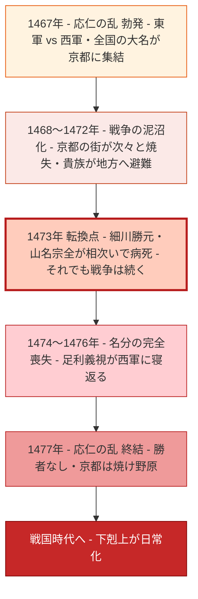
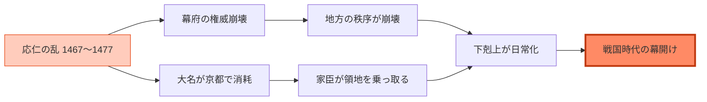

# ⚔️ 応仁の乱② 焼け野原と下剋上の誕生

## <ruby>焼<rt>や</rt></ruby>け<ruby>野原<rt>のはら</rt></ruby>と<ruby>下剋上<rt>げこくじょう</rt></ruby>の<ruby>誕生<rt>たんじょう</rt></ruby>

> **レベル：N2〜N3** ｜ テーマ：<ruby>日本<rt>にほん</rt></ruby>の<ruby>歴史<rt>れきし</rt></ruby>・<ruby>応仁<rt>おうにん</rt></ruby>の<ruby>乱<rt>らん</rt></ruby>（<ruby>全<rt>ぜん</rt></ruby>２<ruby>回<rt>かい</rt></ruby>）

---

## 📖 Part 1 ― <ruby>単語<rt>たんご</rt></ruby>リスト

| # | <ruby>単語<rt>たんご</rt></ruby> | <ruby>読<rt>よ</rt></ruby>み | <ruby>意味<rt>いみ</rt></ruby>（<ruby>韓国語<rt>かんこくご</rt></ruby>） | <ruby>意味<rt>いみ</rt></ruby>（<ruby>英語<rt>えいご</rt></ruby>） |
|---|------|------|----------------|-------------|
| 1 | <ruby>焼<rt>や</rt></ruby>け<ruby>野原<rt>のはら</rt></ruby> | やけのはら | 잿더미, 불탄 벌판 | scorched wasteland |
| 2 | <ruby>泥沼化<rt>どろぬまか</rt></ruby> | どろぬまか | 수렁에 빠짐, 교착 상태 | getting bogged down |
| 3 | <ruby>下剋上<rt>げこくじょう</rt></ruby> | げこくじょう | 하극상 | overthrowing one's superiors |
| 4 | <ruby>権威<rt>けんい</rt></ruby> | けんい | 권위 | authority |
| 5 | <ruby>崩壊<rt>ほうかい</rt></ruby> | ほうかい | 붕괴 | collapse |
| 6 | <ruby>埋没費用<rt>まいぼつひよう</rt></ruby> | まいぼつひよう | 매몰 비용 | sunk cost |

### <ruby>例文<rt>れいぶん</rt></ruby>

**1. <ruby>焼<rt>や</rt></ruby>け<ruby>野原<rt>のはら</rt></ruby>**

> 11<ruby>年間<rt>ねんかん</rt></ruby>の<ruby>戦<rt>たたかい</rt></ruby>いで、<ruby>京都<rt>きょうと</rt></ruby>の<ruby>街<rt>まち</rt></ruby>は<ruby>焼<rt>や</rt></ruby>け<ruby>野原<rt>のはら</rt></ruby>となった。

**2. <ruby>泥沼化<rt>どろぬまか</rt></ruby>**

> <ruby>目的<rt>もくてき</rt></ruby>を<ruby>失<rt>うしな</rt></ruby>った<ruby>戦争<rt>せんそう</rt></ruby>は<ruby>泥沼化<rt>どろぬまか</rt></ruby>し、<ruby>誰<rt>だれ</rt></ruby>も<ruby>止<rt>と</rt></ruby>められなくなった。

**3. <ruby>下剋上<rt>げこくじょう</rt></ruby>**

> <ruby>下剋上<rt>げこくじょう</rt></ruby>の<ruby>時代<rt>じだい</rt></ruby>には、<ruby>身分<rt>みぶん</rt></ruby>よりも<ruby>実力<rt>じつりょく</rt></ruby>が<ruby>物<rt>もの</rt></ruby>を<ruby>言<rt>い</rt></ruby>う。

**4. <ruby>権威<rt>けんい</rt></ruby>**

> <ruby>幕府<rt>ばくふ</rt></ruby>の<ruby>権威<rt>けんい</rt></ruby>が<ruby>失<rt>うしな</rt></ruby>われると、<ruby>地方<rt>ちほう</rt></ruby>では<ruby>混乱<rt>こんらん</rt></ruby>が<ruby>広<rt>ひろ</rt></ruby>がった。

**5. <ruby>崩壊<rt>ほうかい</rt></ruby>**

> <ruby>長年<rt>ながねん</rt></ruby>の<ruby>秩序<rt>ちつじょ</rt></ruby>が<ruby>崩壊<rt>ほうかい</rt></ruby>したとき、<ruby>新<rt>あたら</rt></ruby>しい<ruby>時代<rt>じだい</rt></ruby>が<ruby>始<rt>はじ</rt></ruby>まる。

**6. <ruby>埋没費用<rt>まいぼつひよう</rt></ruby>**

> 「すでに<ruby>費<rt>つい</rt></ruby>やした」という<ruby>理由<rt>りゆう</rt></ruby>だけで<ruby>続<rt>つづ</rt></ruby>けるのは、<ruby>埋没費用<rt>まいぼつひよう</rt></ruby>の<ruby>誤<rt>あやま</rt></ruby>りだ。

---

## 👥 <ruby>戦況<rt>せんきょう</rt></ruby>と<ruby>崩壊<rt>ほうかい</rt></ruby>の<ruby>流<rt>なが</rt></ruby>れ

:::info
応仁の乱がどのように「目的を失った戦争」になっていったかを整理しましょう。
:::

**🔑 <ruby>戦国時代<rt>せんごくじだい</rt></ruby>への<ruby>流<rt>なが</rt></ruby>れ**

---

## 📝 Part 2 ― <ruby>本文<rt>ほんぶん</rt></ruby>

### <ruby>名分<rt>めいぶん</rt></ruby>を<ruby>失<rt>うしな</rt></ruby>った<ruby>戦争<rt>せんそう</rt></ruby>

#### <ruby>一<rt>いち</rt></ruby>、<ruby>当事者<rt>とうじしゃ</rt></ruby>の<ruby>死<rt>し</rt></ruby>と、<ruby>続<rt>つづ</rt></ruby>く<ruby>戦<rt>たたかい</rt></ruby>い

　<ruby>戦<rt>たたかい</rt></ruby>いが<ruby>始<rt>はじ</rt></ruby>まった<ruby>後<rt>のち</rt></ruby>も、<ruby>京都<rt>きょうと</rt></ruby>の<ruby>街<rt>まち</rt></ruby>では<ruby>毎日<rt>まいにち</rt></ruby>のように<ruby>建物<rt>たてもの</rt></ruby>が<ruby>燃<rt>も</rt></ruby>え、<ruby>貴族<rt>きぞく</rt></ruby>たちは<ruby>地方<rt>ちほう</rt></ruby>へと<ruby>逃<rt>に</rt></ruby>げていきました。ところが1473<ruby>年<rt>ねん</rt></ruby>、<ruby>驚<rt>おどろ</rt></ruby>くべき<ruby>出来事<rt>できごと</rt></ruby>が<ruby>起<rt>お</rt></ruby>きました。<ruby>東軍<rt>とうぐん</rt></ruby>の<ruby>大将<rt>たいしょう</rt></ruby>・<ruby>細川勝元<rt>ほそかわかつもと</rt></ruby>と、<ruby>西軍<rt>せいぐん</rt></ruby>の<ruby>大将<rt>たいしょう</rt></ruby>・<ruby>山名宗全<rt>やまなそうぜん</rt></ruby>が、<ruby>相次<rt>あいつ</rt></ruby>いで<ruby>病死<rt>びょうし</rt></ruby>したのです。

　<ruby>戦争<rt>せんそう</rt></ruby>を<ruby>始<rt>はじ</rt></ruby>めた<ruby>二人<rt>ふたり</rt></ruby>の<ruby>当事者<rt>とうじしゃ</rt></ruby>がこの<ruby>世<rt>よ</rt></ruby>を<ruby>去<rt>さ</rt></ruby>りました。さらにその<ruby>後<rt>ご</rt></ruby>、<ruby>後継者問題<rt>こうけいしゃもんだい</rt></ruby>の<ruby>中心<rt>ちゅうしん</rt></ruby>にいた<ruby>足利義視<rt>あしかがよしみ</rt></ruby>が<ruby>西軍<rt>せいぐん</rt></ruby>に<ruby>寝返<rt>ねがえ</rt></ruby>るという<ruby>混乱<rt>こんらん</rt></ruby>まで<ruby>起<rt>お</rt></ruby>きました。もはや「<ruby>義視<rt>よしみ</rt></ruby>を<ruby>守<rt>まも</rt></ruby>るための<ruby>東軍<rt>とうぐん</rt></ruby>」という<ruby>大義名分<rt>たいぎめいぶん</rt></ruby>は<ruby>完全<rt>かんぜん</rt></ruby>に<ruby>消<rt>き</rt></ruby>えていました。それでも<ruby>戦争<rt>せんそう</rt></ruby>は<ruby>止<rt>と</rt></ruby>まりませんでした。

#### <ruby>二<rt>に</rt></ruby>、<ruby>燃<rt>も</rt></ruby>え<ruby>尽<rt>つ</rt></ruby>きた<ruby>京都<rt>きょうと</rt></ruby>

　11<ruby>年<rt>ねん</rt></ruby>にわたる<ruby>戦火<rt>せんか</rt></ruby>の<ruby>中<rt>なか</rt></ruby>で、かつて<ruby>平安京<rt>へいあんきょう</rt></ruby>として<ruby>栄<rt>さか</rt></ruby>えた<ruby>京都<rt>きょうと</rt></ruby>の<ruby>街<rt>まち</rt></ruby>は<ruby>次々<rt>つぎつぎ</rt></ruby>と<ruby>焼<rt>や</rt></ruby>け<ruby>野原<rt>のはら</rt></ruby>になっていきました。<ruby>金閣寺<rt>きんかくじ</rt></ruby>を<ruby>建<rt>た</rt></ruby>てた<ruby>足利義満<rt>あしかがよしみつ</rt></ruby>の<ruby>時代<rt>じだい</rt></ruby>に<ruby>花開<rt>はなひら</rt></ruby>いた<ruby>北山文化<rt>きたやまぶんか</rt></ruby>、そして<ruby>義政<rt>よしまさ</rt></ruby>が<ruby>育<rt>そだ</rt></ruby>てた<ruby>東山文化<rt>ひがしやまぶんか</rt></ruby>の<ruby>多<rt>おお</rt></ruby>くが<ruby>灰<rt>はい</rt></ruby>となりました。<ruby>公家<rt>くげ</rt></ruby>や<ruby>僧侶<rt>そうりょ</rt></ruby>たちは<ruby>各地<rt>かくち</rt></ruby>に<ruby>逃<rt>に</rt></ruby>げ、<ruby>その地<rt>そのち</rt></ruby>で<ruby>文化<rt>ぶんか</rt></ruby>と<ruby>知識<rt>ちしき</rt></ruby>を<ruby>伝<rt>つた</rt></ruby>えました。これが<ruby>皮肉<rt>ひにく</rt></ruby>にも、<ruby>地方<rt>ちほう</rt></ruby>の<ruby>文化<rt>ぶんか</rt></ruby><ruby>水準<rt>すいじゅん</rt></ruby>を<ruby>高<rt>たか</rt></ruby>めることにつながりました。

　1477<ruby>年<rt>ねん</rt></ruby>、<ruby>応仁<rt>おうにん</rt></ruby>の<ruby>乱<rt>らん</rt></ruby>はようやく<ruby>終結<rt>しゅうけつ</rt></ruby>しました。しかし<ruby>勝者<rt>しょうしゃ</rt></ruby>も<ruby>敗者<rt>はいしゃ</rt></ruby>もなく、ただ<ruby>焼<rt>や</rt></ruby>け<ruby>野原<rt>のはら</rt></ruby>だけが<ruby>残<rt>のこ</rt></ruby>りました。

#### <ruby>三<rt>さん</rt></ruby>、<ruby>下剋上<rt>げこくじょう</rt></ruby>と<ruby>戦国時代<rt>せんごくじだい</rt></ruby>の<ruby>幕開<rt>まくあ</rt></ruby>け

　<ruby>応仁<rt>おうにん</rt></ruby>の<ruby>乱<rt>らん</rt></ruby>は、<ruby>単<rt>たん</rt></ruby>に<ruby>京都<rt>きょうと</rt></ruby>を<ruby>焼<rt>や</rt></ruby>いただけではありませんでした。<ruby>長年<rt>ながねん</rt></ruby>にわたって<ruby>地方<rt>ちほう</rt></ruby>を<ruby>離<rt>はな</rt></ruby>れ<ruby>京都<rt>きょうと</rt></ruby>で<ruby>戦<rt>たたか</rt></ruby>い<ruby>続<rt>つづ</rt></ruby>けた<ruby>大名<rt>だいみょう</rt></ruby>たちは、<ruby>自分<rt>じぶん</rt></ruby>の<ruby>領地<rt>りょうち</rt></ruby>が<ruby>留守<rt>るす</rt></ruby>のうちに<ruby>部下<rt>ぶか</rt></ruby>や<ruby>隣国<rt>りんごく</rt></ruby>の<ruby>大名<rt>だいみょう</rt></ruby>に<ruby>奪<rt>うば</rt></ruby>われるという<ruby>事態<rt>じたい</rt></ruby>に<ruby>直面<rt>ちょくめん</rt></ruby>しました。

　「<ruby>上<rt>うえ</rt></ruby>の<ruby>者<rt>もの</rt></ruby>を<ruby>倒<rt>たお</rt></ruby>して<ruby>成<rt>の</rt></ruby>り<ruby>上<rt>あ</rt></ruby>がる」という<ruby>下剋上<rt>げこくじょう</rt></ruby>の<ruby>思想<rt>しそう</rt></ruby>が<ruby>広<rt>ひろ</rt></ruby>がり、<ruby>家柄<rt>いえがら</rt></ruby>や<ruby>身分<rt>みぶん</rt></ruby>よりも<ruby>実力<rt>じつりょく</rt></ruby>こそが<ruby>生存<rt>せいぞん</rt></ruby>の<ruby>条件<rt>じょうけん</rt></ruby>となりました。<ruby>室町幕府<rt>むろまちばくふ</rt></ruby>の<ruby>権威<rt>けんい</rt></ruby>は<ruby>地<rt>ち</rt></ruby>に<ruby>落<rt>お</rt></ruby>ち、<ruby>誰<rt>だれ</rt></ruby>もが<ruby>実力<rt>じつりょく</rt></ruby>だけで<ruby>天下<rt>てんか</rt></ruby>を<ruby>狙<rt>ねら</rt></ruby>える<ruby>戦国時代<rt>せんごくじだい</rt></ruby>が<ruby>始<rt>はじ</rt></ruby>まったのです。

---

## ❓ Part 3 ― <ruby>内容確認<rt>ないようかくにん</rt></ruby>

**Q1.** 1473<ruby>年<rt>ねん</rt></ruby>に<ruby>何<rt>なに</rt></ruby>が<ruby>起<rt>お</rt></ruby>きましたか。

**Q2.** <ruby>足利義視<rt>あしかがよしみ</rt></ruby>は<ruby>途中<rt>とちゅう</rt></ruby>でどんな<ruby>行動<rt>こうどう</rt></ruby>を<ruby>取<rt>と</rt></ruby>りましたか。

**Q3.** <ruby>応仁<rt>おうにん</rt></ruby>の<ruby>乱<rt>らん</rt></ruby>は<ruby>何年<rt>なんねん</rt></ruby>に<ruby>終結<rt>しゅうけつ</rt></ruby>しましたか。<ruby>結果<rt>けっか</rt></ruby>はどうでしたか。

**Q4.** <ruby>大名<rt>だいみょう</rt></ruby>が<ruby>京都<rt>きょうと</rt></ruby>で<ruby>戦<rt>たたか</rt></ruby>っている<ruby>間<rt>あいだ</rt></ruby>に、<ruby>地方<rt>ちほう</rt></ruby>では<ruby>何<rt>なに</rt></ruby>が<ruby>起<rt>お</rt></ruby>きましたか。

**Q5.** 「<ruby>下剋上<rt>げこくじょう</rt></ruby>」とはどういう<ruby>意味<rt>いみ</rt></ruby>ですか。

**Q6.** <ruby>応仁<rt>おうにん</rt></ruby>の<ruby>乱<rt>らん</rt></ruby>が<ruby>地方文化<rt>ちほうぶんか</rt></ruby>に<ruby>与<rt>あた</rt></ruby>えた<ruby>意外<rt>いがい</rt></ruby>な<ruby>影響<rt>えいきょう</rt></ruby>は<ruby>何<rt>なん</rt></ruby>ですか。

---

## ✏️ Part 4 ― <ruby>単語<rt>たんご</rt></ruby>を<ruby>使<rt>つか</rt></ruby>って<ruby>文<rt>ぶん</rt></ruby>を<ruby>作<rt>つく</rt></ruby>ろう

**1.** 「<ruby>焼<rt>や</rt></ruby>け<ruby>野原<rt>のはら</rt></ruby>」を<ruby>使<rt>つか</rt></ruby>って<ruby>文<rt>ぶん</rt></ruby>を<ruby>作<rt>つく</rt></ruby>ってください。

**2.** 「<ruby>泥沼化<rt>どろぬまか</rt></ruby>」を<ruby>使<rt>つか</rt></ruby>って、<ruby>現代<rt>げんだい</rt></ruby>の<ruby>出来事<rt>できごと</rt></ruby>について<ruby>話<rt>はな</rt></ruby>してください。

**3.** 「<ruby>下剋上<rt>げこくじょう</rt></ruby>」を<ruby>使<rt>つか</rt></ruby>って<ruby>文<rt>ぶん</rt></ruby>を<ruby>作<rt>つく</rt></ruby>ってください。

**4.** 「<ruby>権威<rt>けんい</rt></ruby>」を<ruby>使<rt>つか</rt></ruby>って、<ruby>現代<rt>げんだい</rt></ruby>の<ruby>権威<rt>けんい</rt></ruby>について<ruby>話<rt>はな</rt></ruby>してください。

**5.** 「<ruby>崩壊<rt>ほうかい</rt></ruby>」を<ruby>使<rt>つか</rt></ruby>って<ruby>文<rt>ぶん</rt></ruby>を<ruby>作<rt>つく</rt></ruby>ってください。

**6.** 「<ruby>埋没費用<rt>まいぼつひよう</rt></ruby>」という<ruby>概念<rt>がいねん</rt></ruby>をあなた<ruby>自身<rt>じしん</rt></ruby>の<ruby>言葉<rt>ことば</rt></ruby>で<ruby>説明<rt>せつめい</rt></ruby>してください。

---

## 💬 Part 5 ― ディスカッション（<ruby>本文<rt>ほんぶん</rt></ruby><ruby>関連<rt>かんれん</rt></ruby>）

**1.** <ruby>戦<rt>たたかい</rt></ruby>いを<ruby>始<rt>はじ</rt></ruby>めた<ruby>当事者<rt>とうじしゃ</rt></ruby>が<ruby>死<rt>し</rt></ruby>んでも<ruby>戦争<rt>せんそう</rt></ruby>が<ruby>止<rt>と</rt></ruby>まらなかったのはなぜだと<ruby>思<rt>おも</rt></ruby>いますか。

**2.** 「すでに11<ruby>年<rt>ねん</rt></ruby>も<ruby>戦<rt>たたか</rt></ruby>ってきた」という<ruby>理由<rt>りゆう</rt></ruby>で<ruby>戦争<rt>せんそう</rt></ruby>を<ruby>続<rt>つづ</rt></ruby>けることは<ruby>合理的<rt>ごうりてき</rt></ruby>ですか。（<ruby>埋没費用<rt>まいぼつひよう</rt></ruby>の<ruby>観点<rt>かんてん</rt></ruby>から<ruby>考<rt>かんが</rt></ruby>えてみましょう）

**3.** <ruby>下剋上<rt>げこくじょう</rt></ruby>の<ruby>時代<rt>じだい</rt></ruby>は、<ruby>当時<rt>とうじ</rt></ruby>の<ruby>人々<rt>ひとびと</rt></ruby>にとって「<ruby>絶望<rt>ぜつぼう</rt></ruby>」でしたか、「<ruby>機会<rt>きかい</rt></ruby>」でしたか。

**4.** <ruby>京都<rt>きょうと</rt></ruby>が<ruby>焼<rt>や</rt></ruby>け<ruby>野原<rt>のはら</rt></ruby>になったことで、<ruby>文化<rt>ぶんか</rt></ruby>が<ruby>地方<rt>ちほう</rt></ruby>に<ruby>広<rt>ひろ</rt></ruby>まったという<ruby>皮肉<rt>ひにく</rt></ruby>についてどう<ruby>思<rt>おも</rt></ruby>いますか。

**5.** <ruby>権威<rt>けんい</rt></ruby>や<ruby>秩序<rt>ちつじょ</rt></ruby>が<ruby>崩壊<rt>ほうかい</rt></ruby>したとき、<ruby>社会<rt>しゃかい</rt></ruby>にとって<ruby>良<rt>よ</rt></ruby>い<ruby>面<rt>めん</rt></ruby>はありますか。

---

## 🗣️ Part 6 ― フリーディスカッション

**1.** あなたの<ruby>国<rt>くに</rt></ruby>や<ruby>社会<rt>しゃかい</rt></ruby>で、「<ruby>目的<rt>もくてき</rt></ruby>を<ruby>失<rt>うしな</rt></ruby>っても<ruby>続<rt>つづ</rt></ruby>いてしまったこと」（<ruby>慣習<rt>かんしゅう</rt></ruby>・<ruby>制度<rt>せいど</rt></ruby>・<ruby>関係<rt>かんけい</rt></ruby>など）はありますか。

**2.** 「<ruby>埋没費用<rt>まいぼつひよう</rt></ruby>の<ruby>誤<rt>あやま</rt></ruby>り」に<ruby>陥<rt>おちい</rt></ruby>った<ruby>経験<rt>けいけん</rt></ruby>はありますか。どうすれば<ruby>良<rt>よ</rt></ruby>かったと<ruby>思<rt>おも</rt></ruby>いますか。

**3.** <ruby>下剋上<rt>げこくじょう</rt></ruby>のような「<ruby>実力主義<rt>じつりょくしゅぎ</rt></ruby>」の<ruby>社会<rt>しゃかい</rt></ruby>と、<ruby>身分<rt>みぶん</rt></ruby>や<ruby>秩序<rt>ちつじょ</rt></ruby>を<ruby>重視<rt>じゅうし</rt></ruby>する<ruby>社会<rt>しゃかい</rt></ruby>、どちらが<ruby>良<rt>よ</rt></ruby>いと<ruby>思<rt>おも</rt></ruby>いますか。

**4.** <ruby>現代<rt>げんだい</rt></ruby>の<ruby>政治<rt>せいじ</rt></ruby>や<ruby>ビジネス<rt>びじねす</rt></ruby>でも「<ruby>下剋上<rt>げこくじょう</rt></ruby>」は<ruby>起<rt>お</rt></ruby>きていると<ruby>思<rt>おも</rt></ruby>いますか。<ruby>具体例<rt>ぐたいれい</rt></ruby>を<ruby>挙<rt>あ</rt></ruby>げてください。

**5.** <ruby>応仁<rt>おうにん</rt></ruby>の<ruby>乱<rt>らん</rt></ruby>から<ruby>約<rt>やく</rt></ruby>100<ruby>年<rt>ねん</rt></ruby>の<ruby>戦国時代<rt>せんごくじだい</rt></ruby>が<ruby>始<rt>はじ</rt></ruby>まりましたが、「<ruby>混乱<rt>こんらん</rt></ruby>の<ruby>時代<rt>じだい</rt></ruby>」には<ruby>良<rt>よ</rt></ruby>い<ruby>面<rt>めん</rt></ruby>もあると<ruby>思<rt>おも</rt></ruby>いますか。

---

*📌 <ruby>応仁<rt>おうにん</rt></ruby>の<ruby>乱<rt>らん</rt></ruby> 第２<ruby>回<rt>かい</rt></ruby>／<ruby>全<rt>ぜん</rt></ruby>２<ruby>回<rt>かい</rt></ruby>*
